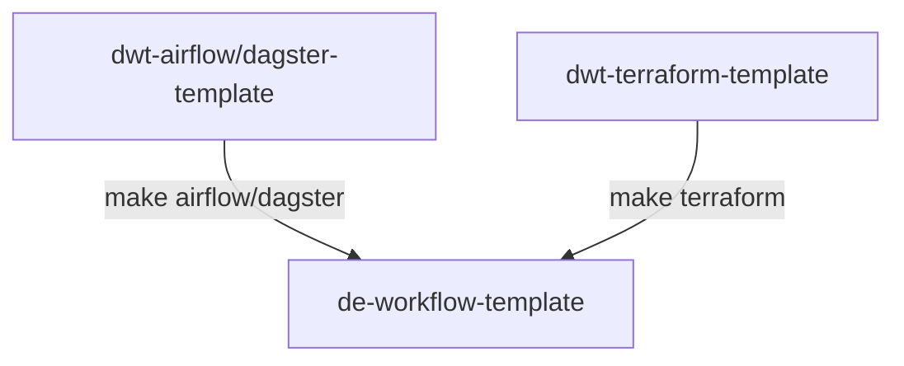

# DE Project Workflow Template
Workflow template for DE projects which includes
1. [**Poetry**](https://python-poetry.org/)
2. [**Pytest**](https://docs.pytest.org/en/6.2.x/)
3. Templates for [**Terraform**](https://www.terraform.io/), [**Docker**](https://www.docker.com/), and [**Cloud Build**](https://cloud.google.com/build/docs/concepts)
4. Orchestrator setup instructions ([**Airflow**](https://airflow.apache.org/) and [**Dagster**](https://dagster.io/))
5. Pre-commit, linters, and PR templates

## System Design
The DE Workflow template is designed to be the main repository for creating Data Engineering templates. The system is designed using a **multi-repo** setup where developers can mix and match multiple templates together to fit the needs of their project.



The system revolves around using `Makefile` to run scripts that would setup the templates automatically. Ideally, a working project can be created by just typing multiple `make` commands that build the template from scratch.

## Getting started
1. Create a new repo using this template (or click this [link](https://github.com/thinkingmachines/de-workflow-template/generate))
2. Read the project checklist (*WIP - will lift this from the standard DE workflow*)
3. Follow the "Initial Setup" steps below
4. Update this `README` file

## Initial setup
1. Install Poetry (for other operating systems, check the steps on the [Poetry repo](https://github.com/python-poetry/poetry#installation))
```bash
# Linux
curl -sSL https://raw.githubusercontent.com/python-poetry/poetry/master/install-poetry.py | python3 -
```
2. Update your project's metadata - in `pyproject.toml`, update the `name`, `description`, and `authors` fields
3. Create a virtual environment and install dependencies
```bash
make dev
```
4. Activate the virtual environment
```bash
source .venv/bin/activate
```
5. Initialize your orchestrator
```bash
# Airflow
make airflow

# Dagster
make dagster project=<project-name>
```
6. Go to the orchestrator's template repository for further instructions
    - [Airflow Template Repository](https://github.com/thinkingmachines/dwt-airflow-template#de-workflow-template-setup) (Start at Step 3 on DE Workflow Template Section)
    - Dagster Template Repository

## Resources
* [**Poetry wiki**](https://wiki.tm8.dev/doc/poetry-exIJa15ukh)
* [**de-commons repo**](https://github.com/thinkingmachines/de-commons)
* [**Airflow Template Repo**](https://github.com/thinkingmachines/dwt-airflow-template)

---

**DELETE EVERYTHING ABOVE FOR YOUR PROJECT**

---

# < Insert Project Name Here >

## Description
< Insert Project Description Here >

## Setup

### Requirements
1. Python >=3.7
2. make
3. Poetry

### Development
1. Install Poetry (for other operating systems, check the steps on the [Poetry repo](https://github.com/python-poetry/poetry#installation))
```bash
# Linux
curl -sSL https://raw.githubusercontent.com/python-poetry/poetry/master/install-poetry.py | python3 -
```
2. Create a virtual environment and install dependencies
```bash
make dev
```
3. Activate the virtual environment
```bash
source .venv/bin/activate
```

### Environment variables
```
cp -i .env.example .env
```
Edit the `.env` and `.env.example` files based on your project needs

### Running tests
Ensure that tests exist in the `tests` directory and run the command below to execute all checks
```bash
make test
```
